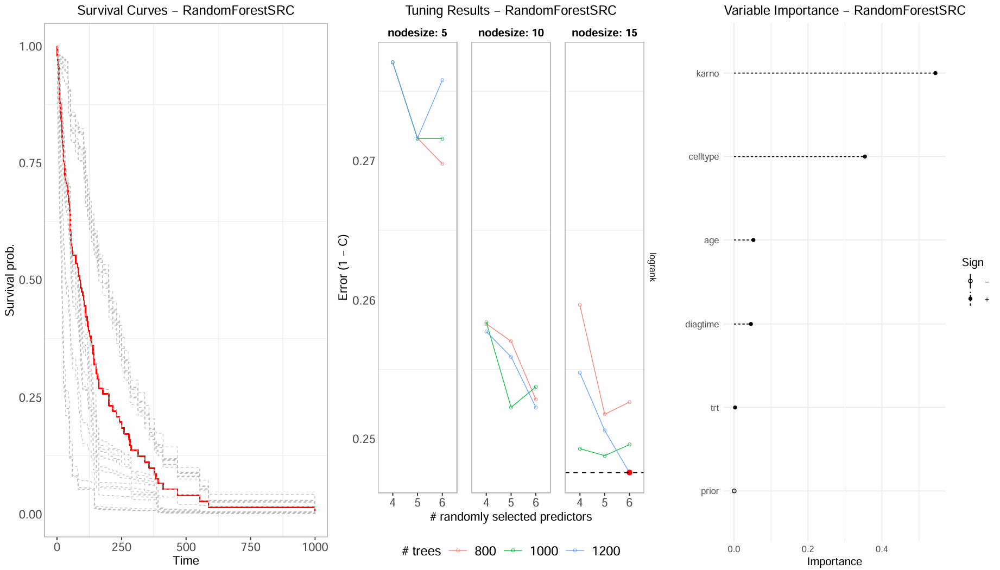
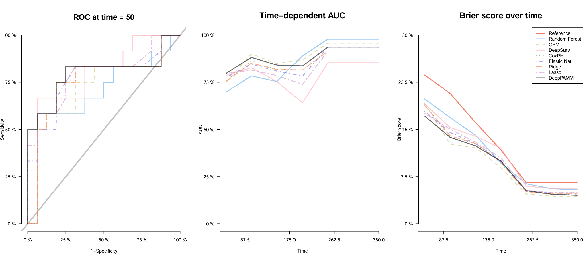
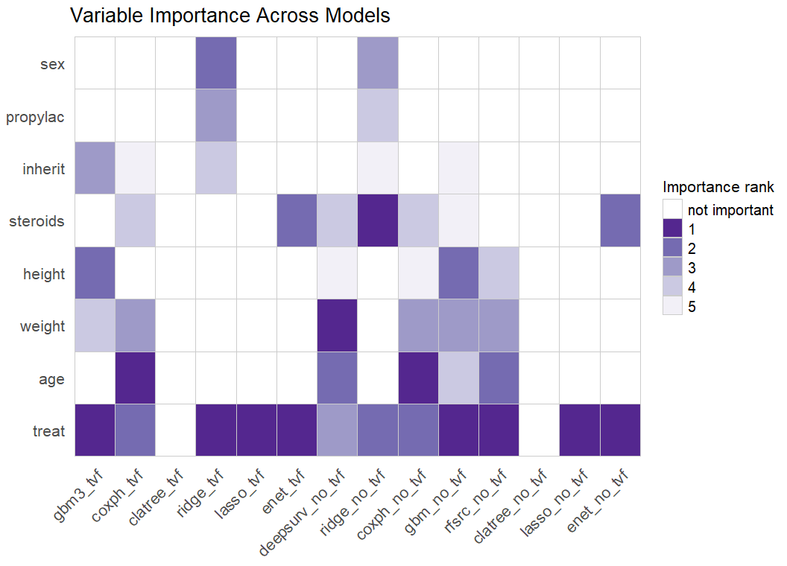

# TVF-SurvFlow

**A standardized, user-friendly R framework for survival analysis with time-varying features (TVFs).**

TVF-SurvFlow wraps a range of classical and machine-learning survival models behind a
single, consistent interface, so that several model families can be trained, evaluated,
and compared under one workflow — optionally with time-varying covariates. Each model
produces the same set of outputs (concordance index, individual survival curves,
variable importance).
 

 
Each model can be compared head-to-head with shared metrics
(time-dependent ROC/AUC, Brier score, prediction error curves).



Variable of importances can be compared across models.


> **Status: research code.** This project was developed as a semester research project
> and is provided as a working analysis framework, not (yet) a formally packaged,
> CRAN-installable R package. Some components are marked as work-in-progress below.
> See [Known limitations](#known-limitations) before relying on any single path.

---

## What it is built on

TVF-SurvFlow is **an extension of the [`satpred`](https://github.com/CYGUBICKO/satpred)
package** ("Survival Analysis Training and PREDiction") by Steve Cygu (GitHub: CYGUBICKO).
satpred provides the underlying tuning/fitting machinery (`modtune()`, `modfit()`) and the
model back-ends used here for the random survival forest, gradient boosting, and DeepSurv
models (`rfsrc.satpred`, `gbm.satpred`, `gbm3.satpred`, `deepsurv.satpred`), plus the
shared getters (`get_survconcord()`, `get_indivsurv()`, `get_varimp()`).

On top of satpred, this project adds:

- **Deep-learning survival models** — DeepSurv (via satpred/`survivalmodels`) and
  **DeepPAMM** (via [`deeppamm`](https://github.com/) + `pammtools`, Keras/TensorFlow).
- **Time-varying feature (TVF) handling** — every model can be trained on
  `(tstart, tstop, status)` counting-process data, toggled by a single `tvf` argument.
- **A unified model-comparison layer** — time-dependent ROC/AUC and Brier score
  (`riskRegression::Score`) and prediction error curves (`pec::pec`) across all models,
  including custom S3 bridges so that `pcoxtime` and `DeepPAMM` objects work with these
  tools (which do not support them natively).

### Full list of upstream packages

| Purpose | Packages |
|---|---|
| Core survival | `survival`, `satpred`, `pcoxtime`, `randomForestSRC` |
| Boosting | `gbm`, `gbm3` |
| Trees (left-truncated) | `LTRCtrees`, `partykit` |
| Deep learning | `survivalmodels`, `deeppamm`, `pammtools`, `keras`, `tensorflow` |
| Metrics / comparison | `pec`, `riskRegression`, `survcomp` |
| Plotting / data | `ggplot2`, `survminer`, `gridExtra`, `grid`, `gridGraphics`, `RColorBrewer`, `dplyr`, `tidyr`, `purrr`, `reshape2`, `data.table`, `pdp`, `caret` |

> **Licensing note:** because this framework is derived from and depends on `satpred`
> (and other GitHub/Bioconductor packages), confirm each upstream package's license before
> any public redistribution. `pcoxtime` is GPL (≥ 2) on CRAN; `satpred`'s license should be
> checked directly on its repository. A GPL-3 license is assumed here as a safe default.

---

## Models available

| Model | Function | TVF support | Back-end |
|---|---|:---:|---|
| Cox proportional hazards | `coxph_func()` | ✅ | `survival` |
| Penalized Cox — ridge / lasso / elastic net | `pcox_func()` | ✅ | `pcoxtime` |
| Random survival forest | `rfsrc_func()` | ❌ (no-TVF) | `satpred` / `randomForestSRC` |
| Gradient boosting | `gbm_func()` | ❌ (no-TVF) | `satpred` / `gbm` |
| Gradient boosting (gbm3) | `gbm3_func()` | ✅ | `satpred` / `gbm3` |
| Left-truncated classification tree | `clatree_func()` | ✅ | `LTRCtrees` / `partykit` |
| DeepSurv | `deepsurv_func()` | ❌ (no-TVF) | `satpred` / `survivalmodels` |
| DeepPAMM | `deeppamm_func()` | ❌ (no-TVF) | `deeppamm` / `pammtools` |

All model wrappers are reachable through a single dispatcher, `model()`.

---

## Features

- Choose whether or not to include time-varying features via a single `tvf` flag.
- Automatically generated per-model PDF report with:
  - concordance (C-index)
  - individual survival curves
  - variable importance
  - tuning plot (where applicable)
- Model-comparison tools across all fitted models:
  - time-dependent ROC (at one or several horizons)
  - AUC over time
  - Brier score over time
  - prediction error curves (PEC)
  - variable importance heatmap across models
- Reproducible train/test splitting **by subject `id`** (so repeated rows from the same
  subject never straddle the split).
- Utilities to simulate missing data and impute it, for robustness experiments.

---

## Repository layout

```
TVF-SurvFlow/
├── TVF-SurvFlow_functions.R   # all function definitions (models, metrics, utilities)
├── TVF-SurvFlow_main.R        # end-to-end example workflow on the CGD dataset
├── README.md
├── DESCRIPTION                # package-style metadata + dependency list
├── images/                    # example output figures
└── test-utils.R/              # runnable unit tests for the utility functions
```

---

## Installation / setup

There is currently **no `install.packages()`** step — the framework is used by sourcing
the functions file. To run it you need the upstream packages installed first.

```r
# CRAN packages
install.packages(c(
  "survival", "randomForestSRC", "pec", "riskRegression", "gbm",
  "survivalmodels", "pammtools", "gridExtra", "gridGraphics", "ggplot2",
  "survminer", "tidyr", "dplyr", "reshape2", "data.table", "partykit",
  "pdp", "purrr", "RColorBrewer", "caret", "LTRCtrees"
))

# Bioconductor
if (!requireNamespace("BiocManager", quietly = TRUE)) install.packages("BiocManager")
BiocManager::install("survcomp")

# GitHub-only packages
# install.packages("devtools")
devtools::install_github("CYGUBICKO/satpred")
devtools::install_github("gbm-developers/gbm3")
# pcoxtime, deeppamm: install from their respective sources

# Deep-learning models additionally require a working Keras/TensorFlow (Python) backend:
install.packages(c("keras", "tensorflow"))
tensorflow::install_tensorflow()
```

Then:

```r
source("TVF-SurvFlow_functions.R")
```

> The classical models (Cox, penalized Cox, RSF, GBM, tree) run without Python.
> **Only the deep-learning models (DeepSurv, DeepPAMM) require the Keras/TensorFlow
> Python environment.**

---

## Quick start

The `main` script demonstrates the full workflow on the **CGD (Chronic Granulomatous
Disease)** clinical trial dataset from the `survival` package, which is turned into a
counting-process (time-varying) format with `survival::tmerge()`.

```r
source("TVF-SurvFlow_functions.R")

outdir <- "outputs"                       # use a relative path
create_output_folder(outdir)

# --- build a time-varying (tstart, tstop, status) data frame from cgd0 ---
# (see TVF-SurvFlow_main.r for the full tmerge pipeline)

# formulas expected by the model functions (see "Known limitations" — these are
# currently read as globals by the model functions):
var <- setdiff(colnames(df), c("id", "tstart", "tstop", "status"))
formula_with_tvf_without_cluster    <- as.formula(paste("Surv(tstart, tstop, status) ~", paste(var, collapse = " + ")))
formula_without_tvf_without_cluster <- as.formula(paste("Surv(tstop, status) ~",         paste(var, collapse = " + ")))

# --- split, then train any model through the dispatcher ---
splitted <- split_data(df, train_prop = 0.8, seed = 8888)

res_cox   <- model(df, "coxph", outdir, tvf = TRUE,  splitted)
res_lasso <- model(df, "lasso", outdir, tvf = TRUE,  splitted)
res_rsf   <- model(df, "rfsrc", outdir, tvf = FALSE, splitted)
```

Each call writes a PDF report to `outputs/summaries_for_each_model/` and saves the fitted
model to `outputs/models/`. See `TVF-SurvFlow_main.r` for the full multi-model comparison,
the repeated-seed C-index benchmark, and the variable-importance heatmap.

---

## The CGD dataset

Validation and examples use CGD, from:
The International Chronic Granulomatous Disease Cooperative Study Group,
*A controlled trial of interferon gamma to prevent infection in chronic granulomatous
disease*, New England Journal of Medicine 324:509–516, 1991. It ships with the `survival`
package as `cgd0`, and is well-suited to TVF work because each subject has multiple
time-stamped infection events.

---

## Known limitations

1. **Model functions rely on global formula objects.** `coxph_func()`, `pcox_func()`,
   `rfsrc_func()`, etc. read `formula_with_tvf_without_cluster` /
   `formula_without_tvf_without_cluster` from the global environment rather than taking
   them as arguments. They must be defined in the workspace (as in the main script) before
   calling any model. Turning these into function arguments is the first change needed to
   package the code.
2. **Hardcoded absolute paths** exist in `TVF-SurvFlow_main.r` (and a default in
   `postprocess_comparison()`); replace with relative paths / arguments before reuse.
3. **TVF not yet supported everywhere.** The comparison functions
   (`plot_survival_metrics()`, `compute_pec_all()`) and the RSF, GBM, DeepSurv, and DeepPAMM
   models currently run in the no-TVF setting only (marked in the source).
4. **Deep-learning reproducibility** depends on the Keras/TensorFlow backend and is not
   seed-deterministic across machines.

---

## Author & attribution

Framework by **Capucine Labat-Berthier**, developed in the Computational Biology Group
(Prof. N. Beerenwinkel), D-BSSE, ETH Zürich.

Built on and extends **`satpred`** by Steve Cygu (https://github.com/CYGUBICKO/satpred).
Please cite/credit satpred and the other upstream packages listed above when using this work.
